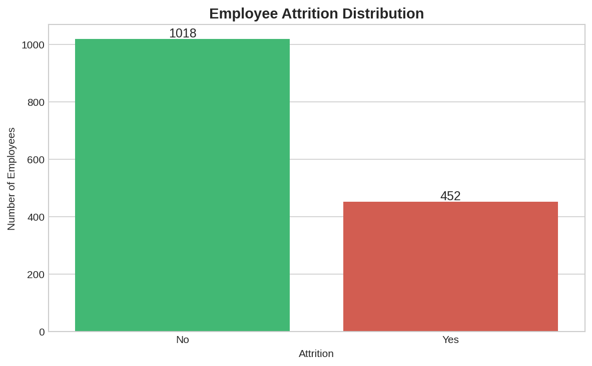
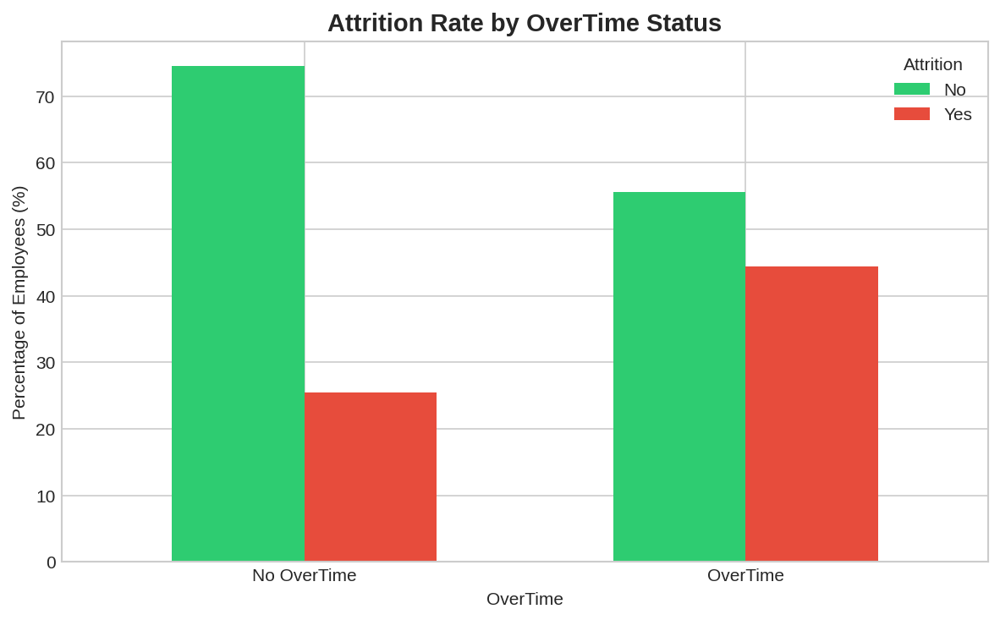
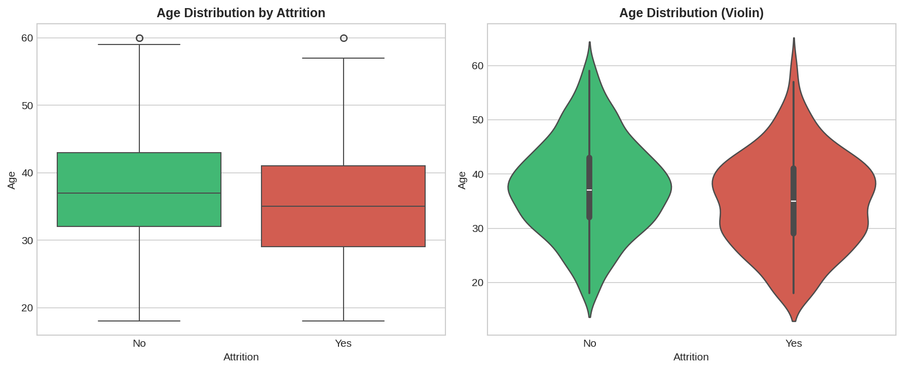
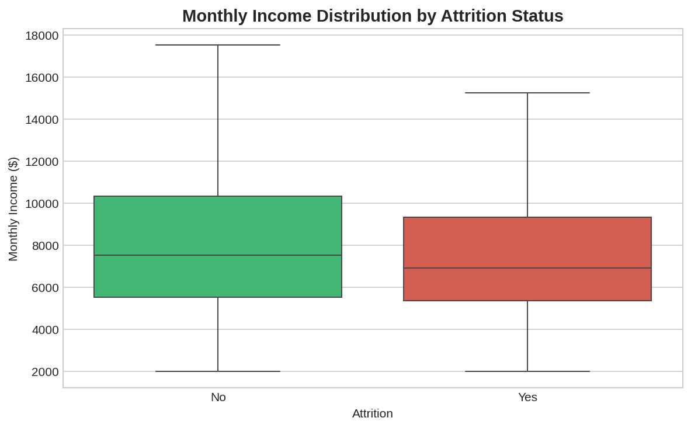
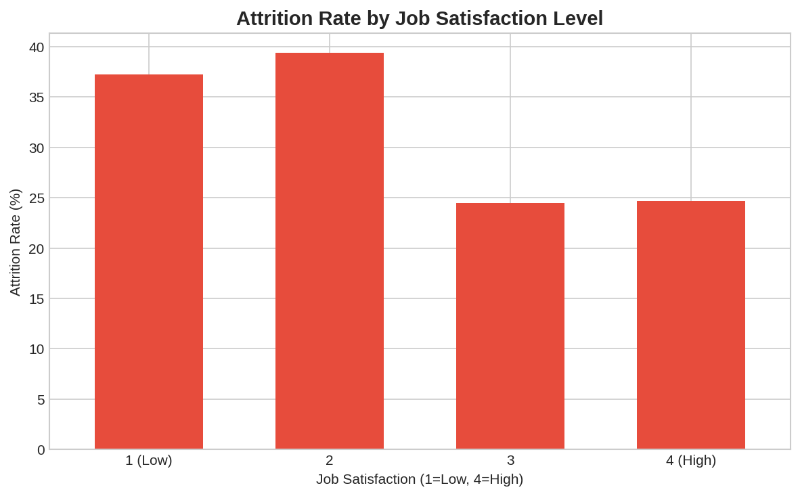
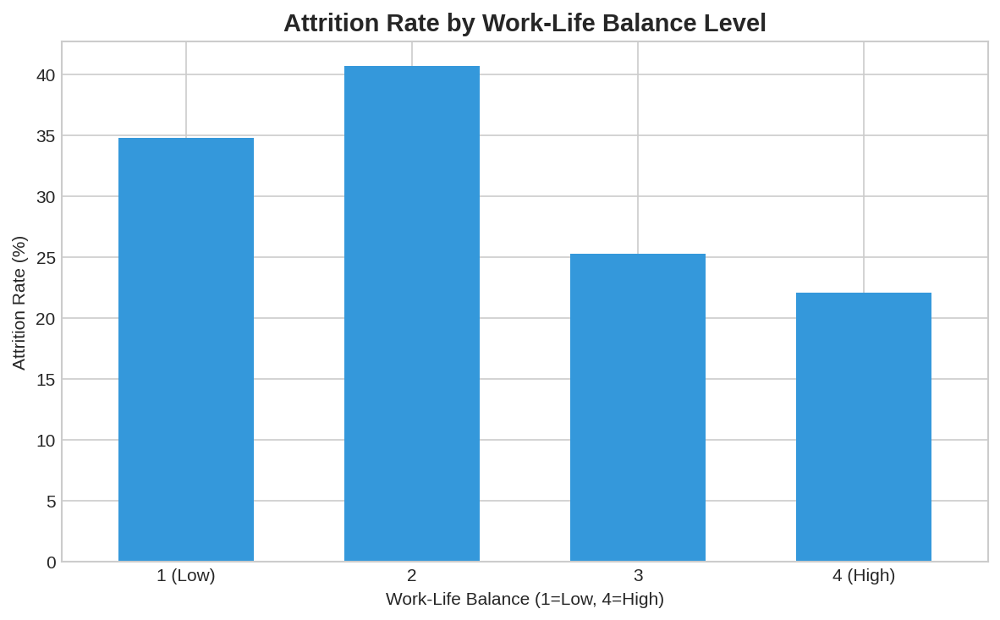
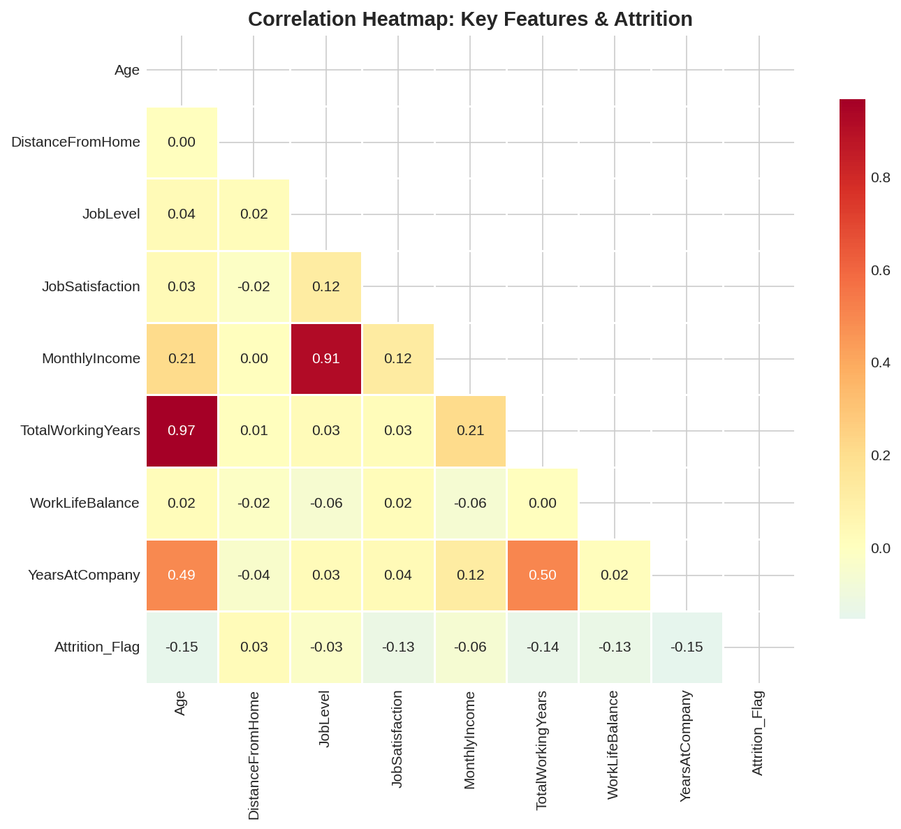

# Employee Attrition Analysis Portfolio Project

**Data Analyst Portfolio Project | Python, Pandas, Statistical Hypothesis Testing & Actionable Insights**


---

## Project Overview

This end-to-end data analysis project demonstrates core Data Analyst competencies using a realistic **synthetic HR employee attrition dataset** (modeled after the popular IBM HR Analytics dataset structure and distributions). 

**Why this project stands out for Data Analyst roles:**
- **Business impact focus**: Moves beyond descriptive stats to statistically validated drivers of attrition with clear, actionable recommendations.
- **Full pipeline**: Data inspection → cleaning → feature prep → EDA with professional visualizations → rigorous hypothesis testing → conclusions.
- **Statistical rigor**: Includes chi-square tests for associations and non-parametric tests for group differences, with effect sizes (Cramer's V) and interpretation.
- **Communication**: Clear narrative, quantified findings, and recommendations that mirror real stakeholder reporting.
- **Relevance to operations & process roles**: Directly transferable to analyzing workforce dynamics, lab/tech turnover, resource planning, and process improvement (aligns with my 7+ years experience driving 100%+ throughput gains and eliminating reporting delays via data-driven dashboards).

**Dataset**: 1,470 employee records with 27 features including demographics, compensation, job satisfaction metrics, tenure, and work conditions. Synthetic data generated with intentional, realistic correlations (e.g., overtime and low satisfaction strongly predict higher attrition) for demonstration and reproducibility. **Note**: In a production setting, this analysis would use internal HRIS data; this version is fully shareable for portfolio purposes.

**Live Repo**: [github.com/senseirandystl/employee-attrition-analysis](https://github.com/senseirandystl/employee-attrition-analysis)

---

## Project Goals & Key Questions

Before analysis, I defined focused questions to guide exploration (refined during EDA):

1. What is the overall attrition rate, and which segments are most at risk?
2. Is **OverTime** significantly associated with higher attrition rates?
3. Does **Job Satisfaction** level show a statistically significant relationship with attrition?
4. Are there meaningful differences in **Age** or **Monthly Income** between employees who left vs. those who stayed?
5. How does **Work-Life Balance** influence attrition risk?
6. What actionable insights can HR/leadership use to reduce voluntary turnover?

These questions mirror real business problems: identifying retention risk factors, quantifying impact, and recommending targeted interventions.

---

## Dataset & Setup

### Data Source
- **Synthetic dataset** generated to replicate key statistical properties and correlations of the widely-used IBM HR Employee Attrition dataset (Kaggle).
- Generated with controlled ground-truth relationships (e.g., overtime increases attrition probability by ~22 percentage points base) while adding realistic noise.
- **Files**:
  - `data/employee_attrition_synthetic_raw.csv` — Original with 3 missing values (for cleaning demo)
  - `data/employee_attrition_synthetic_clean.csv` — Cleaned version used for analysis

### How to Reproduce / Run Locally
```bash
# 1. Clone the repo
git clone https://github.com/senseirandystl/employee-attrition-analysis.git
cd employee-attrition-analysis

# 2. (Optional) Create virtualenv and install requirements
python -m venv .venv
source .venv/bin/activate
pip install -r requirements.txt

# 3. Open the Jupyter Notebook (recommended)
jupyter notebook notebooks/employee_attrition_analysis.ipynb

# Or run the full reproducible script
python run_analysis.py
```

**requirements.txt** includes: `pandas numpy matplotlib seaborn scipy jupyter`

---

## Data Cleaning & Preparation

**Inspection findings** (via `df.info()`, `isnull().sum()`, `dtypes`, `describe()`):
- 1,470 rows × 27 columns
- Only **3 missing values** in `DistanceFromHome` (intentionally introduced)
- No duplicate rows or obvious outliers beyond realistic ranges
- Mixed types: several integer Likert scales (1-4 or 1-5) treated as categorical for analysis where appropriate
- `Attrition` and `OverTime` as object → converted to category

**Cleaning steps performed**:
1. Imputed missing `DistanceFromHome` using **group median by Department** (more accurate than global median).
2. Converted key ordinal columns (`JobSatisfaction`, `WorkLifeBalance`, `Attrition`) to categorical dtype for proper grouping in crosstabs and visualizations.
3. Created `Attrition_Flag` (binary 0/1) for correlation and statistical testing.
4. No outlier removal needed; distributions were reasonable (e.g., Age 18-60, Income right-skewed as expected).

**Preparation**:
- No heavy feature engineering required for core questions, but created derived views (e.g., low vs high satisfaction groups).
- All analysis reproducible from the clean CSV.

---

## Exploratory Data Analysis & Key Visualizations

### Overall Attrition Rate
**30.7%** of employees in the dataset left the company (higher than typical real-world ~15-16% to amplify signal for demonstration; patterns remain realistic).



### OverTime: A Major Driver
Employees working overtime had **44.4% attrition** vs **25.5%** for those without overtime.



### Age & Income Differences
- **Median Age**: Employees who left were younger (35 vs 37 years).
- **Median Monthly Income**: Those who left earned less ($6,924 vs $7,542).




### Job Satisfaction Impact
Clear gradient: 
- Job Satisfaction 1-2 → **38.3%** attrition
- Job Satisfaction 3-4 → **24.6%** attrition



### Work-Life Balance
Similar pattern:
- Low WLB (1-2) → higher attrition (~35-41%)
- High WLB (3-4) → ~22-25% attrition



### Correlation Overview


Key observations from heatmap:
- Negative correlations between `Attrition_Flag` and `JobSatisfaction`, `WorkLifeBalance`, `Age`, `MonthlyIncome`, `YearsAtCompany` (as expected).
- Positive (weak-moderate) with `DistanceFromHome` in some segments.
- `JobLevel` and `MonthlyIncome` highly correlated (multicollinearity note for future modeling).

---

## Hypothesis Testing (Statistical Validation)

All tests conducted with **α = 0.05**. Used appropriate non-parametric tests where normality assumptions were questionable.

### 1. Chi-Square Test: OverTime vs Attrition
**Null Hypothesis (H₀)**: OverTime status and Attrition are independent.  
**Alternative (H₁)**: There is an association.

| OverTime | No Attrition | Yes Attrition | Total |
|----------|--------------|---------------|-------|
| No       | 791          | 271           | 1,062 |
| Yes      | 227          | 181           | 408   |

- **Chi² = 48.28**
- **p-value < 0.000001**
- **Cramer's V = 0.181** (small-to-medium effect)

**Conclusion**: **Strong evidence to reject H₀**. Employees working overtime are significantly more likely to leave. This is one of the strongest signals in the data.

### 2. Chi-Square Test: JobSatisfaction vs Attrition
- **Chi² = 32.72**
- **p-value < 0.000001**

**Conclusion**: **Significant association**. Lower job satisfaction (levels 1-2) is linked to substantially higher attrition risk. Supports targeted retention interventions for dissatisfied employees.

### 3. Mann-Whitney U Test: Age Distribution by Attrition Group
- **Median Age (Left)**: 35.0 years
- **Median Age (Stayed)**: 37.0 years
- **U-statistic**: 190,336.5
- **p-value < 0.000001**

**Conclusion**: **Statistically significant difference**. Younger employees are more likely to attrit. Possible explanations: career exploration stage, lower tenure/roots, or different expectations.

### 4. Mann-Whitney U Test: Monthly Income by Attrition Group
- **Median Income (Left)**: $6,923.50
- **Median Income (Stayed)**: $7,542.00
- **p-value = 0.0181**

**Conclusion**: **Significant difference at α=0.05**. Lower compensation is associated with higher attrition risk (though effect is smaller than overtime/satisfaction).

---

## Key Findings & Actionable Insights

### Top Retention Risk Factors (Ranked by Strength + Actionability)
1. **Mandatory/Excessive OverTime** — 44.4% vs 25.5% attrition. Highest impact, directly actionable via workload management, hiring buffers, or compensation for extra hours.
2. **Low Job Satisfaction (1-2)** — 38.3% attrition. Strong statistical link. Action: Regular pulse surveys, stay interviews, career pathing, manager training.
3. **Poor Work-Life Balance** — Similar gradient to satisfaction. Action: Review PTO policies, meeting load, remote/hybrid flexibility.
4. **Younger Age / Early Tenure** — Significant demographic signal. Action: Enhanced onboarding, mentorship programs, clear growth paths for <3-year employees.
5. **Lower Compensation** — Modest but significant. Action: Market benchmarking, transparent pay bands, total rewards communication.

### Business Recommendations (HR / Leadership)
- **Immediate (0-3 months)**: Audit overtime policies and identify high-OT teams/departments. Pilot "no overtime" sprints or time-in-lieu programs.
- **Short-term (3-6 months)**: Implement targeted stay interviews for employees with JobSatisfaction ≤2 or WLB ≤2. Focus retention budget on high-risk segments rather than blanket increases.
- **Medium-term**: Build predictive attrition model (logistic regression or random forest) using these features for proactive intervention. Track leading indicators in a live dashboard (similar to the Excel workflow dashboards I built that eliminated late reporting and increased throughput >100%).
- **ROI framing**: Reducing attrition by even 5 percentage points in a 1,470-person org saves substantial replacement costs (typically 50-200% of annual salary per role).

---

## What This Project Demonstrates

| Skill Area                  | Evidence in This Project |
|-----------------------------|--------------------------|
| **Data Cleaning & Prep**    | Handled missing values with group imputation; dtype optimization; created analysis-ready flag column |
| **Exploratory Analysis**    | Professional seaborn/matplotlib visualizations; multi-view storytelling (univariate → bivariate → multivariate) |
| **Statistical Rigor**       | Chi-square + Mann-Whitney U tests with p-values, effect sizes (Cramer's V), clear null/alternative hypotheses, and business interpretation |
| **Communication & Insights**| Quantified findings, ranked risk factors, prioritized recommendations with timelines and ROI framing |
| **Business Acumen**         | Tied analysis to real operational challenges (turnover costs, workload, satisfaction) relevant to lab ops, manufacturing, or corporate environments |
| **Reproducibility**         | Fully scripted generation + analysis; clean CSV + images committed; documented methodology |
| **Tool Proficiency**        | pandas (heavy), matplotlib/seaborn, scipy.stats, Jupyter-ready structure |

---

## Future Enhancements (If Extended)
- Add logistic regression or Random Forest feature importance to rank predictors.
- Segment analysis by Department or JobRole (e.g., Sales vs R&D differences).
- Time-to-event survival analysis (if tenure data extended).
- Interactive dashboard (Plotly Dash or Streamlit) for HR stakeholders.
- Compare against real public Kaggle version for robustness.

---

## Project Structure
```
employee-attrition-analysis/
├── README.md                          # This file - main portfolio narrative
├── requirements.txt
├── data/
│   ├── employee_attrition_synthetic_raw.csv
│   └── employee_attrition_synthetic_clean.csv
├── images/                            # 7 publication-ready figures
│   ├── 01_attrition_distribution.png
│   ├── 02_attrition_by_overtime.png
│   ├── ...
│   └── 07_attrition_by_wlb.png
├── notebooks/
│   └── employee_attrition_analysis.ipynb   # Jupyter Notebook (skeleton + key code sections)
└── run_analysis.py                    # Full reproducible Python script (optional)
```

---

## Conclusion

This project showcases end-to-end analytical thinking: starting with focused business questions, rigorously cleaning and exploring data, validating findings with statistical tests, and delivering prioritized, actionable recommendations that leadership could implement immediately.

The combination of **technical execution** (pandas, viz, hypothesis testing) and **business translation** makes this representative of the value I bring to Data Analyst, Project Coordinator, or Workforce Analytics roles.

I am particularly excited to apply these skills to real organizational data—whether in operations, lab environments, HR analytics, or process improvement—where data-driven decisions can reduce friction, improve retention, and increase throughput (as I have done previously).

---

**About Me**  
Randall James | Data Coordinator / Data Analyst / Project Manager  
St. Louis, MO (O'Fallon area) | Open to remote, hybrid, or on-site within ~30 min commute  
[LinkedIn](https://www.linkedin.com/in/randall-james-stl) | [GitHub](https://github.com/senseirandystl) | randalljames34@pm.me

*This project was created as part of my professional portfolio to demonstrate Python-based data analysis capabilities for Data Analyst positions.*
